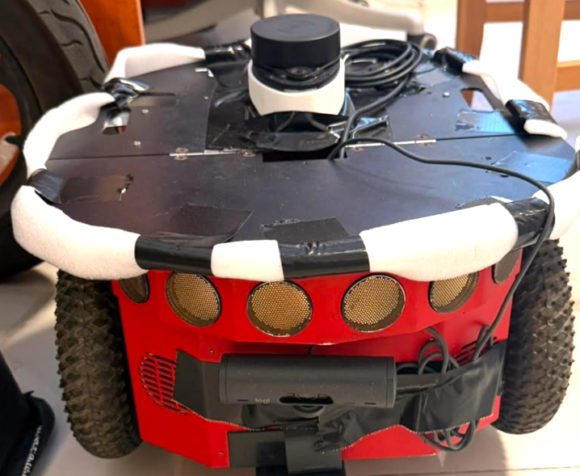
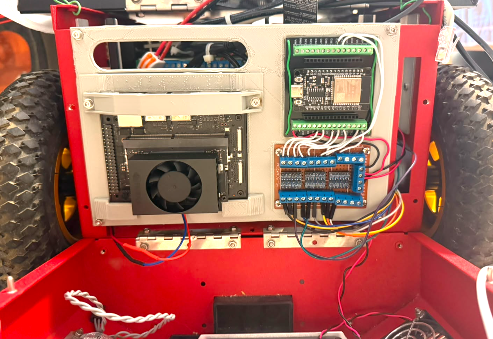
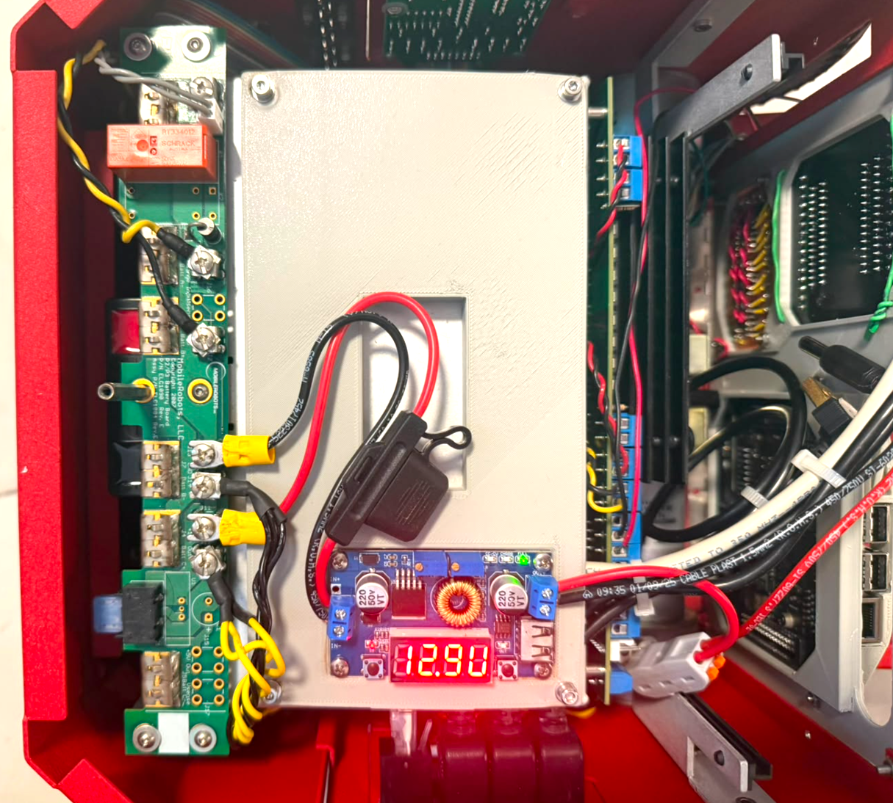
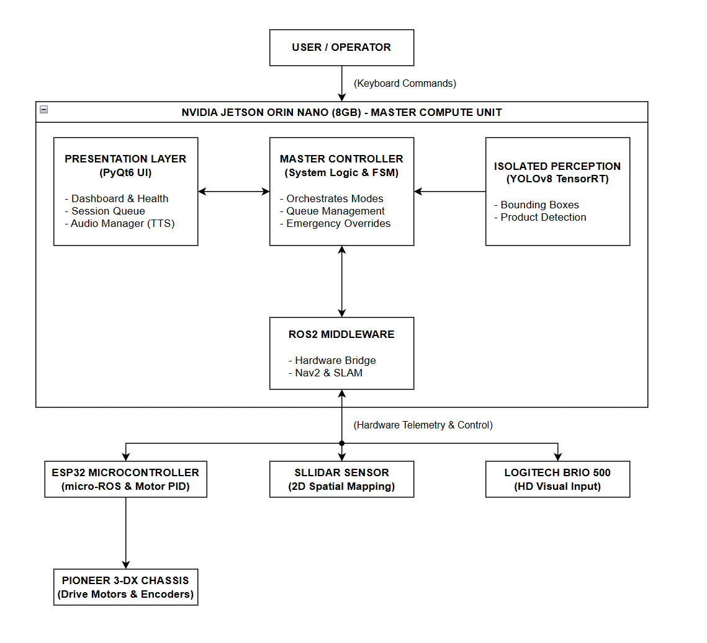
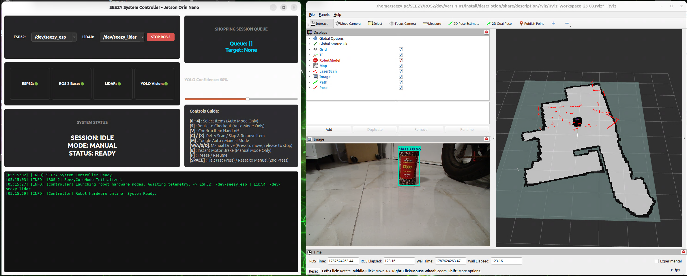

# SEEZY: Autonomous Supermarket Assistant


## 🛒 Project Overview
**SEEZY** is an autonomous supermarket assistant robot designed to guide visually impaired customers. It navigates to requested items, detects them using a custom YOLOv8 model (trained on 5 specific classes: milk, ketchup, bamba, coffee, toothpaste), and safely guides the user to the checkout counter.


<p align="center">
  
  
</p>


## ⚙️ Hardware Stack
The physical architecture relies on a master-slave processing configuration:
*   **Master Compute:** NVIDIA Jetson Orin Nano (8GB).
*   **Motor Controller:** ESP32 Microcontroller (running a 50Hz micro-ROS hardware PID loop).
*   **Perception:** Logitech Brio 500 webcam (1280x720 HD).
*   **Navigation / SLAM:** SLLidar (360-degree 2D planar scan).
*   **Chassis:** Pioneer 3-DX with dual DC drive motors and differential wheel base.




---

## 📂 Repository Architecture (The 4 Pillars)

The project is divided into four strictly decoupled modules to guarantee UI responsiveness and hardware safety:

### 1. `software/` (System Controller & UI)
A decoupled, multi-threaded PyQt6 application that acts as the "master brain". It strictly separates the graphical presentation layer from the ROS 2 middleware (running on a dedicated `QThread`) to ensure the dashboard never freezes during heavy TensorRT inference or network latency.

### 2. `ros2_workspace/` (Robot Navigation & Bringup)
Contains the core ROS 2 Jazzy packages. This includes the Nav2 stack, URDF 3D descriptions, SLAM mapping configurations, and the master launch files required for physical robot bringup.

### 3. `image_processing/` (Vision Pipeline Development)
The computer vision sandbox. While production inference runs via the `perception/vision_node.py` subprocess, this folder contains the development pipelines: Google Colab YOLOv8 training notebooks, local Windows testing scripts, and TensorRT (`.engine`) conversion tools.

### 4. `esp32/` (Firmware)
Custom C++ firmware implementing a micro-ROS auto-reconnect Ping State Machine. It constantly pings the Jetson over serial and zeroes the motors automatically if the ROS 2 connection drops.

---

## 🚀 Installation & Setup

### 1. System Requirements
*   **OS:** Ubuntu 24.04 LTS
*   **Environment:** ROS 2 Jazzy, Python 3.12

### 2. Udev Rules & Hardware Ports
For the hardware to launch reliably, persistent Linux `udev` rules must be applied to securely lock the hardware ports.
*   ESP32 maps to: `/dev/seezy_esp`
*   LiDAR maps to: `/dev/seezy_lidar`

### 3. Python Environment
Install the native audio engine (for asynchronous text-to-speech) and the Python dependencies:
```bash
sudo apt update && sudo apt install espeak
python3 -m venv venv
source venv/bin/activate
pip install -r software/requirements.txt
```
---

## 🎮 Execution & Controls



### Launching the System
1. Navigate to the `software` directory.
2. Launch the UI using your bash script (e.g., `./start_ui.sh` or `python3 main.py`).
3. Select your hardware ports for the ESP32 and LiDAR in the GUI dropdown menus.
4. Click **LAUNCH ROS 2** to safely orchestrate the hardware bringup. This action securely manages the ROS 2 background process group and launches the YOLO vision node subprocess.
5. Wait for the Subsystem Health indicators (ROS 2 Base, YOLO Vision, LiDAR) to turn green (🟢), which confirms live telemetry is flowing.

### State Machine & Keyboard Mapping
The system enforces strict cross-mode safety locks via a three-tier state machine (Status, Session, Mode) to prevent conflicting commands.

| Key | Action | Mode Requirement |
| :--- | :--- | :--- |
| **`[1-5]`** | Select Items to add to the shopping queue | AUTO |
| **`[6]`** | Route to Checkout Counter | AUTO |
| **`[V]`** | Confirm Item Hand-off (Resumes route after successful detection) | AUTO |
| **`[C] / [X]`** | Retry Scan / Skip & Remove Item (Used if detection times out) | AUTO |
| **`[M]`** | Toggle between AUTO and MANUAL operating modes | ANY |
| **`[W/A/S/D]`** | Manual Drive (Press and hold to move, release to silently stop) | MANUAL |
| **`[E]`** | Instant Motor Brake | MANUAL |
| **`[F]`** | Freeze / Resume (Saves active Nav2 coordinates and pauses motion) | ANY |
| **`[SPACE] / [H]`** | Emergency Halt (1st Press - instantly cuts motors and kills Nav2 paths) <br> Reset System (2nd Press - clears the queue and resets to IDLE/MANUAL) | ANY |
